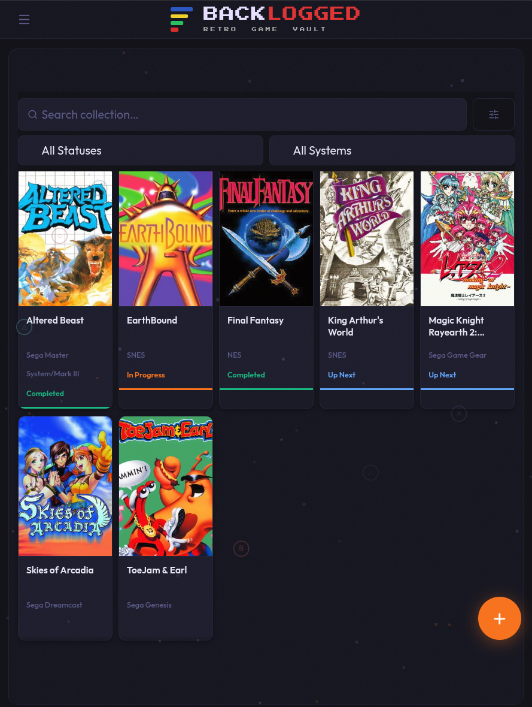
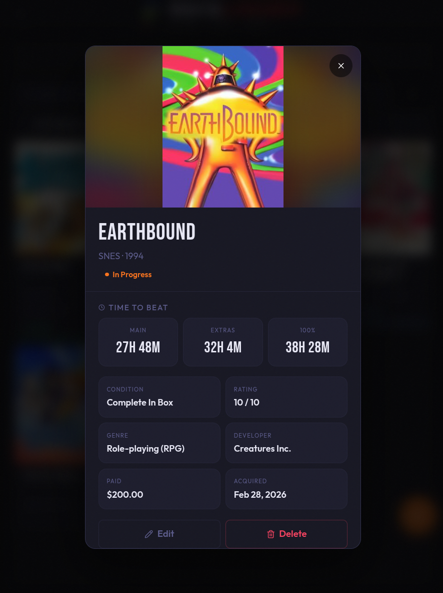
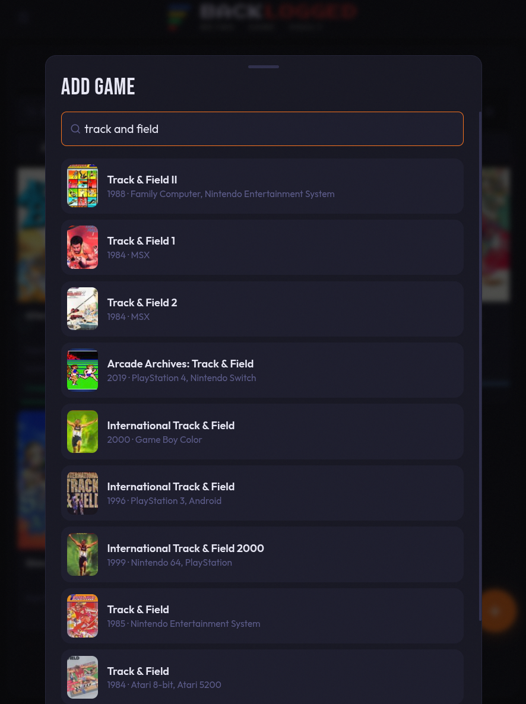
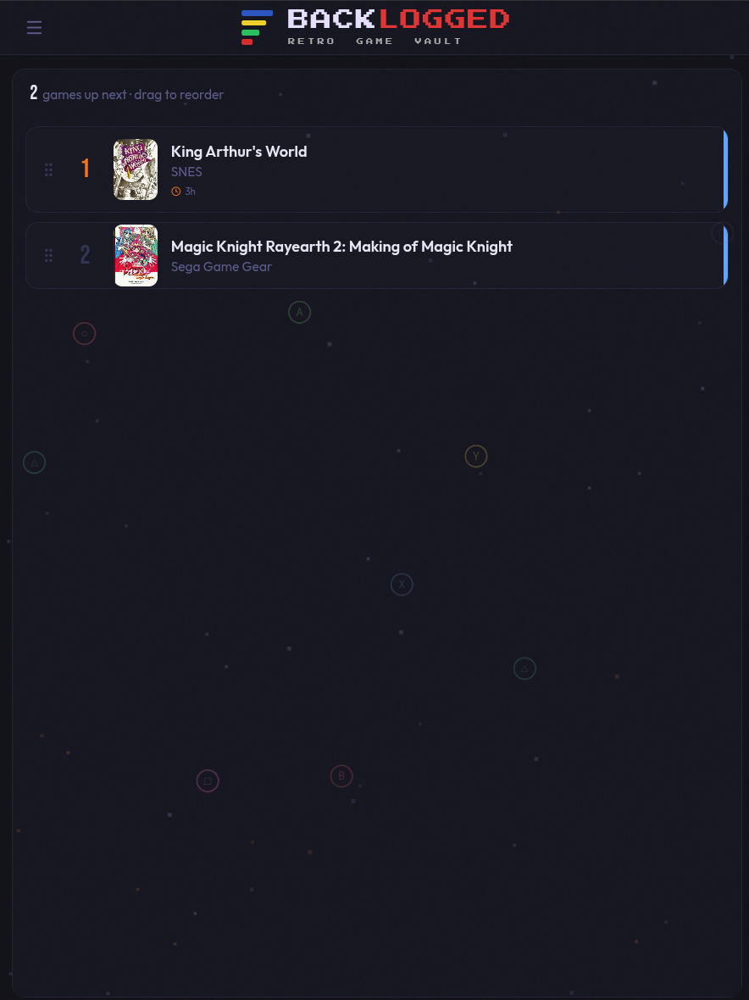

# BACKLOGGED

**A self-hosted retro game collection tracker.**

Keep tabs on what you own, what you want, and what's next in the queue. BACKLOGGED pulls cover art and metadata from IGDB and time-to-beat estimates from HowLongToBeat, so adding a game takes seconds.

---

## Screenshots

<table>
  <tr>
    <td></td>
    <td></td>
  </tr>
  <tr>
    <td></td>
    <td></td>
  </tr>
</table>

---

## Features

- **Collection & Wishlist** — track owned games and a want list separately
- **Status tracking** — Unplayed, Up Next, In Progress, Completed, Dropped
- **IGDB integration** — search for any game and auto-fill cover art, platform, release year, genre, and developer
- **HowLongToBeat** — fetches Main Story / Extras / 100% estimates automatically
- **Personal playthrough** — log your own completion date and hours played
- **Backlog queue** — drag-and-drop reordering for your Up Next list
- **Filter & search** — filter by status and platform, full-text search
- **Purchase tracking** — condition, price paid, date acquired, where you bought it
- **Retro aesthetic** — dark UI with pixel fonts and animated game controller buttons in the background
- **Single-container deploy** — one Docker image, SQLite on a volume, no external database

---

## Tech Stack

| Layer    | Technology |
|----------|-----------|
| Frontend | React, TypeScript, Vite, Tailwind CSS |
| Backend  | Node.js, Express, TypeScript |
| Database | SQLite via Drizzle ORM |
| Auth     | JWT (single-user) |
| Deploy   | Docker, Docker Compose |

---

## Quick Start

### Docker Compose

```bash
git clone https://github.com/jeremyfry/backlogged.git
cd backlogged
cp .env.example .env
```

Edit `.env`:

```env
# Generate with: openssl rand -hex 32
JWT_SECRET=your-secret-here

# Creates your login on first start — remove after initial run
INITIAL_USERNAME=admin
INITIAL_PASSWORD=yourpassword
```

Then:

```bash
docker compose up -d
```

Open **http://localhost:3000**. If you didn't set `INITIAL_*` vars, the app will walk you through setup on first load.

---

## Configuration

All configuration is via environment variables or the `.env` file.

| Variable           | Required | Description |
|--------------------|----------|-------------|
| `JWT_SECRET`       | Yes      | Secret for signing auth tokens. Generate with `openssl rand -hex 32`. |
| `INITIAL_USERNAME` | No       | Auto-creates a user on first start. Remove after the first run. |
| `INITIAL_PASSWORD` | No       | Password for the auto-created user (min 8 characters). |
| `PORT`             | No       | Host port to expose (default: `3000`). |
| `IGDB_CLIENT_ID`   | No       | Twitch/IGDB client ID for game search. Get one at [dev.twitch.tv](https://dev.twitch.tv/console). |
| `IGDB_CLIENT_SECRET` | No     | Twitch/IGDB client secret. |
| `DATABASE_PATH`    | No       | Override the SQLite file path (default: `data/backlogged.db`). |
| `CONFIG_PATH`      | No       | Override the config file path (default: `data/config.json`). |

### Password Reset

If you get locked out, create a file at `data/reset-pass.txt` inside the container (or on the bind-mounted volume) containing your new password. The server reads and deletes it on next startup.

```bash
# Example — writing into the named volume via a temp container
echo "newpassword" | docker run --rm -i -v backlogged_data:/data alpine sh -c "cat > /data/reset-pass.txt"
docker restart backlogged
```

To change both username and password: `newusername:newpassword`

---

## Proxmox LXC

To deploy directly to a Proxmox LXC (Docker-in-LXC), run this on your Proxmox host:

```bash
# Clone just the script, or copy it from the repo
curl -fsSL https://raw.githubusercontent.com/jeremyfry/backlogged/main/scripts/create-lxc.sh | \
  INITIAL_PASSWORD=yourpassword bash
```

Or with custom settings:

```bash
VMID=201 STORAGE=local-lvm APP_PORT=3000 INITIAL_PASSWORD=yourpassword \
  bash scripts/create-lxc.sh
```

The script will:
1. Download an Ubuntu 22.04 LXC template
2. Create an unprivileged LXC container
3. Install Docker inside it
4. Clone this repo, write the `.env`, and start the app
5. Register a systemd service so it survives reboots

---

## Development

```bash
# Install dependencies
npm install

# Start backend + frontend dev servers
npm run dev

# Run tests
npm test
```

The backend runs on `http://localhost:3001` and the frontend dev server proxies API requests automatically.

---

## License

MIT
